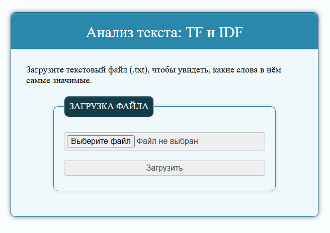
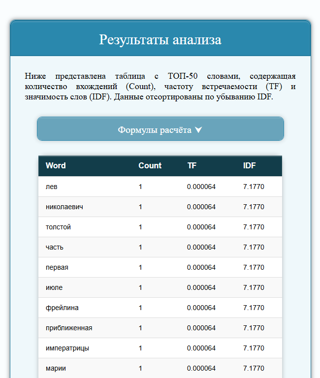

# Text Analysis Web App

Простое веб-приложение на Flask для анализа текстовых файлов.  
Позволяет подсчитать количество слов, вычислить частоту (TF) и значимость (IDF) слов в тексте.

## Технологии

- Python 3.10+
- Flask ~3.1.0
- HTML / CSS

## Структура проекта
    python_basic_diploma/
    ├── app.py               # Основной файл Flask-приложения
    ├── utils.py             # Логика обработки текста и вычисления метрик
    │── .gitignore           # Файл исключений Git
    ├── requirements.txt     # Список зависимостей
    ├── images/
    │   ├── main_page.png
    │   ├── result_page.png
    ├── static/
    │   └── style.css        # Стили сайта
    └── templates/
        ├── index.html       # Страница загрузки файла
        ├── redirect.html    # Страница перенаправления
        └── result_of_analysis.html # Страница с результатами анализа
    └── README.md


## Установка проекта

1. Клонировать репозиторий:
    ```
    cd your-repo-name
    git clone https://github.com/MelKatya/Text_Analysis_Web_App.git
    ```

2. Установить зависимости:
    ```
    pip install -r requirements.txt
    ```
3. Запустить приложение:

   ```
   python app.py
   ```

4. Открыть в браузере:

http://127.0.0.1:5000/

## Скриншоты

**Главная страница загрузки файла:**  



---

**Страница с результатами анализа:**  


---

## Примечания

- Ожидается загрузка текстового файла в формате `.txt` до 256 КБ.
- При загрузке происходит автоматический расчёт метрик: количества слов, TF и IDF.
- Результаты выводятся в табличной форме, отсортированной по убыванию IDF.

## Лицензия

Проект распространяется без ограничений для личного и учебного использования.
